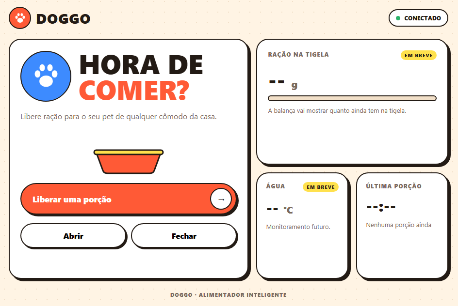

# Doggo

Sistema IoT embarcado em ESP32 que funciona como alimentador e bebedouro automático para pets. O ESP32 atua como servidor HTTP na rede Wi-Fi local e oferece uma página web de onde o tutor libera ração, acompanha a quantidade de ração na tigela e a temperatura da água, e liga ou desliga a fonte de água. Os eventos do sistema são registrados com data e hora na memória Flash (LittleFS).

Situação atual: o protótipo físico está montado e o dispenser de ração é controlado pela página web. A balança, o sensor de temperatura, a fonte de água, a API completa e o registro de eventos estão em desenvolvimento.



## Sumário

1. [Funcionalidades](#funcionalidades)
2. [Hardware](#hardware)
3. [Protocolos](#protocolos)
4. [API](#api)
5. [Registro de eventos](#registro-de-eventos)
6. [Progresso](#progresso)
7. [Pendências](#pendências)
8. [Estrutura do repositório](#estrutura-do-repositório)
9. [Como executar](#como-executar)

## Funcionalidades

| Funcionalidade | Status |
| :--- | :--- |
| Página web de controle servida pelo ESP32 | Concluído |
| Abrir, fechar e liberar uma porção de ração pelo servo | Concluído |
| Painel com indicador de conexão e horário da última porção | Concluído |
| Conexão Wi-Fi como cliente ou como ponto de acesso (modo AP) | Concluído |
| Dosagem por peso com a balança (HX711) | Pendente |
| Leitura da temperatura da água (DS18B20) | Pendente |
| Acionamento da fonte de água pelo relé | Pendente |
| Rotas `/status`, `/alimentar`, `/fonte` e `/logs` | Pendente |
| Registro de eventos com data e hora (NTP) em LittleFS | Pendente |
| Reconexão automática do Wi-Fi | Pendente |

## Hardware

| Componente | Função |
| :--- | :--- |
| ESP32 | Microcontrolador com Wi-Fi; executa o servidor web. |
| Célula de carga 1 kg + módulo HX711 | Mede a massa de ração disponível na tigela. |
| Sensor de temperatura DS18B20 (à prova d'água) | Mede a temperatura da água no reservatório. |
| Servomotor SG90 (9 g) | Abre e fecha o dispenser de ração. |
| Módulo relé 5 V (1 canal) | Liga e desliga a fonte de água elétrica. |

Ligações já definidas no firmware:

| Componente | Pino do ESP32 |
| :--- | :--- |
| Servomotor SG90 (sinal) | GPIO 19 |

## Protocolos

| Camada | Protocolo |
| :--- | :--- |
| Aplicação | HTTP (interface e API) e NTP (data e hora dos registros) |
| Transporte | TCP, porta 80 |
| Rede | IPv4, endereço estático ou dinâmico |
| Enlace | Wi-Fi IEEE 802.11 b/g/n |

## API

Rotas implementadas na versão atual:

| Método | Rota | Descrição | Resposta |
| :--- | :--- | :--- | :--- |
| `GET` | `/` | Interface web de controle. | HTML |
| `GET` | `/abrir` | Move o servo para a posição aberta (90°). | `Aberto` |
| `GET` | `/fechar` | Move o servo para a posição fechada (0°). | `Fechado` |
| `GET` | `/dose` | Libera uma porção: abre o dispenser por 400 ms e fecha em seguida. | `Porção liberada!` |

Rotas planejadas:

| Método | Rota | Descrição | Parâmetro / resposta |
| :--- | :--- | :--- | :--- |
| `GET` | `/status` | IP, MAC, estado da rede e leituras dos sensores. | `{ "ip": "192.168.1.100", "peso_g": 120.5, "temp_agua": 22.4 }` |
| `POST` | `/alimentar` | Libera ração até a balança atingir o peso informado. | `?gramas=150` |
| `POST` | `/fonte` | Liga ou desliga a fonte de água. | `?status=1` ou `?status=0` |
| `GET` | `/logs` | Histórico de eventos gravado na memória Flash. | Texto ou JSON |

## Registro de eventos

Conforme os requisitos da disciplina, o sistema deverá:

- reconectar-se automaticamente quando a rede Wi-Fi cair;
- registrar os eventos com data e hora sincronizadas pelo servidor NTP `pool.ntp.org`;
- classificar os registros em `[INFO]`, `[AVISO]` e `[ERRO]` e gravá-los na memória Flash com a biblioteca LittleFS, para que sejam mantidos após reinicializações.

Formato planejado:

```text
[2026-09-10 10:15:02] [INFO] Sistema inicializado. IP: 192.168.1.105 | MAC: AA:BB:CC:11:22:33
[2026-09-10 10:15:03] [INFO] Sincronização NTP realizada com sucesso.
[2026-09-10 10:20:15] [INFO] Dosagem solicitada: 100g. Servo acionado.
[2026-09-10 10:20:22] [INFO] Dosagem concluída. Peso medido pelo HX711: 101.2g. Servo fechado.
[2026-09-10 11:00:00] [AVISO] Temperatura da água elevada: 28.5°C.
[2026-09-10 11:45:12] [ERRO] Conexão Wi-Fi perdida. Iniciando rotina de reconexão...
[2026-09-10 11:45:18] [INFO] Wi-Fi reestabelecido com sucesso.
```

## Progresso

- [x] Protótipo físico em papelão
- [x] Interface web responsiva
- [x] Aquisição e teste de todos os componentes de hardware
- [x] Firmware com servidor web na porta 80 e página de controle embutida
- [x] Conexão Wi-Fi como cliente da rede local ou como ponto de acesso (modo AP)
- [x] Controle do servo pela página: abrir, fechar e liberar uma porção
- [x] Nova interface web com painel de cartões, indicador de conexão e horário da última porção

## Pendências

- [ ] Leitura da balança (HX711) e calibração da célula de carga
- [ ] Leitura da temperatura da água (DS18B20) e alerta de temperatura elevada
- [ ] Acionamento do relé da fonte de água
- [ ] Rotas `/status`, `/alimentar`, `/fonte` e `/logs`
- [ ] Dosagem por peso; atualmente a porção é liberada por tempo
- [ ] Sincronização de hora por NTP e registro de eventos em LittleFS
- [ ] Reconexão automática do Wi-Fi; atualmente, se a rede não conectar na inicialização, a placa permanece aguardando
- [ ] Senha do modo AP com no mínimo 8 caracteres, exigência do ESP32; com a senha atual a rede não é criada
- [ ] Renomear a rede do modo AP, ainda chamada "Doogo"

## Estrutura do repositório

```text
Doggo/
├── README.md
├── docs/
│   └── interface-web.png    Captura da interface web
└── firmware/
    └── doggo/
        └── doggo.ino        Firmware do ESP32
```

## Como executar

1. Instale a [Arduino IDE](https://www.arduino.cc/en/software) e adicione o pacote de placas ESP32 da Espressif pelo Gerenciador de Placas.
2. Instale a biblioteca ESP32Servo pelo Gerenciador de Bibliotecas.
3. Abra `firmware/doggo/doggo.ino`.
4. Defina o modo de rede no início do arquivo:
   - `USAR_AP = false`: o ESP32 conecta-se à rede definida em `WIFI_SSID` e `WIFI_SENHA`;
   - `USAR_AP = true`: o ESP32 cria a própria rede (`AP_SSID` e `AP_SENHA`).
5. Conecte o sinal do servo ao GPIO 19, selecione a placa e a porta e faça o upload.
6. Abra o Monitor Serial a 115200 baud. O endereço da interface é exibido na linha `Acesse: http://...`.
7. Acesse esse endereço pelo navegador de um dispositivo conectado à mesma rede.
